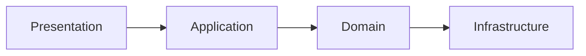
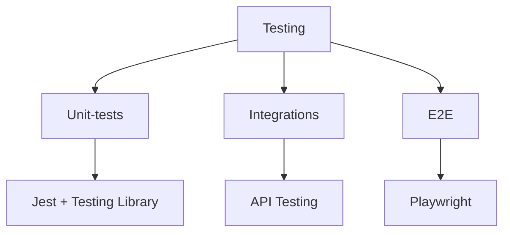
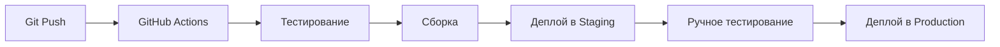

# 🎥 Rental Hub - Аренда фото-видео оборудования


Современная платформа для аренды профессионального фото-видео оборудования с мгновенным бронированием и управлением.

## 🚀 Быстрый старт

```bash
# Клонировать репозиторий
git clone https://github.com/yourusername/rental_hub.git
cd rental_hub

# Установить зависимости
npm install

# Настроить переменные окружения
cp .env.example .env.local

# Запустить в режиме разработки
npm run dev

```

## 🏗️ Архитектура
Проект построен на основе **Clean Architecture** с разделением на слои



#### Ключевые принципы:
- **Domain First** - бизнес-логика независима от фреймворков

- **Dependency Inversion** - зависимости направлены к ядру

- **Testability** - каждый слой изолированно тестируем

## 🗂️ Структура директорий

```bash
src/
├── app/                    # App Router
│   ├── (marketing)/        # Public pages
│   ├── (dashboard)/        # User page
│   ├── (admin)/            # Admin-panel
│   └── api/                # API endpoints
├── core/                   # Core (DDD)
│   ├── domain/             # Entities and business rules
│   ├── application/        # Use Cases and services
│   ├── infrastructure/     # External dependencies
│   └── shared/             # Shared utils
├── components/             # React components
│   ├── core/               # Business-components
│   ├── ui/                 # UI components
│   └── layouts/            # Layouts
└── lib/                    # Configs and clients
```

## 🎯 Основные модули

### 1.  Каталог оборудования
    - Фильтрация по категориям, цене, бренду
    - Детальные карточки с фото и характеристиками
    - Проверка доступности в реальном времени

### 2. Система бронирования
    - Календарь выбора дат
    - Расчет стоимости онлайн
    - Мгновенное подтверждение

### 3. Управление заказами
    - История бронирований
    - Статусы заказов
    - Уведомления по email

### 4. Админ-панель
    - Управление оборудованием
    - Просмотр статистики
    - Обработка заказов

## 🛠️ Разработка

Команды npm
```bash
# Запуск в dev режиме
npm run dev

# Сборка для production
npm run build

# Запуск production сборки
npm start

# Проверка кода
npm run lint
npm run format
npm run type-check

# Тестирование
npm run test:unit      # Юнит-тесты
npm run test:e2e       # E2E тесты
npm run test:ci        # CI тесты
```

Git Workflow
```bash
# Установка git hooks
npm run prepare

# Conventional Commits
git commit -m "feat: add equipment filter"
git commit -m "fix: resolve booking calendar bug"
git commit -m "docs: update api documentation"
```
Переменные окружения
```bash
# Supabase
NEXT_PUBLIC_SUPABASE_URL=https://your-project.supabase.co
NEXT_PUBLIC_SUPABASE_ANON_KEY=your-anon-key
SUPABASE_SERVICE_ROLE_KEY=your-service-role-key

# Дополнительные
NEXT_PUBLIC_APP_URL=http://localhost:3000
STRIPE_SECRET_KEY=sk_test_...
```
## 🧪 Тестирование


## 🚀 Деплой

Vercel
```bash 
vercel deploy --prod
```
Docker
```bash
FROM node:20-alpine
WORKDIR /app
COPY . .
RUN npm ci --only=production
RUN npm run build
CMD ["npm", "start"]
```
## 📈 Мониторинг и аналитика
- Vercel Analytics - метрики производительности
- Sentry - отслеживание ошибок
- Google Analytics - поведение пользователей
- Supabase Logs - мониторинг запросов
text

## Authentication
Все запросы требуют JWT токена в заголовке:
Authorization: Bearer <token>

text

## Endpoints

### Equipment
```
GET /equipment - Получить список оборудования
GET /equipment/:id - Получить детали оборудования
POST /equipment - Создать новое оборудование (admin)
PUT /equipment/:id - Обновить оборудование (admin)
DELETE /equipment/:id - Удалить оборудование (admin)
```


### Bookings
```
GET /bookings - Получить мои бронирования
POST /bookings - Создать бронирование
GET /bookings/:id - Получить детали бронирования
PUT /bookings/:id/cancel - Отменить бронирование
```

### Users
```
GET /users/me - Получить профиль
PUT /users/me - Обновить профиль
GET /users/me/bookings - Получить историю бронирований
```


## Примеры запросов

```typescript
// Получить доступное оборудование
fetch('/api/equipment?available=true&category=camera', {
  headers: { 'Authorization': `Bearer ${token}` }
})
```
Статусы ответов
```
200: Успешно

201: Создано

400: Ошибка валидации

401: Не авторизован

403: Доступ запрещен

404: Не найдено

500: Внутренняя ошибка сервера
```


### 2. **Development Guide (`/docs/development.md`)**

```markdown
# Руководство разработчика

## Начало работы

### 1. Установка зависимостей
```bash
nvm use 20  # Используем Node.js 20
npm ci      # Чистая установка зависимостей
```
### 2. Настройка окружения
```bash
cp .env.example .env.local
# Отредактируйте .env.local
```
### 3. Запуск локальной базы данных
```bash
# Используем Supabase Local
npx supabase start
```
## Рабочий процесс

Структура компонентов
```text
src/components/
├── core/          # Бизнес-компоненты (без стилей)
│   └── EquipmentCard/
│       ├── index.tsx      # Экспорт
│       ├── EquipmentCard.tsx  # Логика
│       └── types.ts       # Типы
├── ui/            # UI компоненты (со стилями)
│   └── EquipmentCard/
│       ├── index.tsx
│       ├── EquipmentCard.tsx  # Стилизованная версия
│       └── variants/     # Варианты компонента
└── layouts/       # Макеты
```
Создание нового компонента
```bash
npm run generate:component Button --type=ui
```
### Тестирование
Типы тестов
- Юнит-тесты: Тестирование отдельных функций

- Интеграционные: Тестирование взаимодействия модулей

- E2E: Тестирование пользовательских сценариев

Запуск тестов
```bash
npm run test              # Все тесты
npm run test:watch        # Watch mode
npm run test:e2e          # E2E тесты
npm run test:coverage     # Покрытие кода
Code Style
Commit Convention
text
feat:     Новая функциональность
fix:      Исправление бага
docs:     Изменения в документации
style:    Форматирование
refactor: Рефакторинг
test:     Добавление тестов
chore:    Рутинные задачи
Линтинг и форматирование
bash
npm run lint     # Проверка стиля
npm run format   # Автоформатирование
npm run type-check # Проверка типов
```

### 3. **Deployment Guide (`/docs/deployment.md`)**

# Руководство по деплою

## Деплой на Vercel (рекомендуется)

### 1. Подключение репозитория
1. Войдите в [Vercel](https://vercel.com)
2. Импортируйте GitHub репозиторий
3. Настройте переменные окружения

### 2. Конфигурация
```json
{
  "buildCommand": "npm run build",
  "outputDirectory": ".next",
  "installCommand": "npm ci"
}
```
3. Домены
- Production: https://rentalhub.com

- Preview: https://*.vercel.app

- Staging: https://staging.rentalhub.com

Деплой на собственном сервере
### Docker Compose
```yaml
version: '3.8'
services:
  app:
    build: .
    ports:
      - "3000:3000"
    environment:
      - DATABASE_URL=${DATABASE_URL}
    depends_on:
      - db
  
  db:
    image: supabase/postgres:latest
    environment:
      - POSTGRES_PASSWORD=${DB_PASSWORD}
```
## CI/CD Pipeline


## Мониторинг
Метрики производительности
- Core Web Vitals: LCP, FID, CLS

- Ошибки: Sentry для отслеживания

- Логи: Vercel Log Drain + Supabase Logs

## Health Checks
```
GET /api/health       # Статус приложения
GET /api/health/db    # Статус базы данных
GET /api/health/cache # Статус кэша
```

## Резервное копирование
### База данных
```bash
# Ежедневный бэкап
pg_dump $DATABASE_URL > backup-$(date +%Y%m%d).sql

# Восстановление
psql $DATABASE_URL < backup.sql
```

## Медиафайлы
- Автоматическое копирование в S3/Cloud Storage

- Версионирование файлов

```text 

## 🚀 **Скрипты инициализации**

### `scripts/init-project.sh`

```bash
#!/bin/bash

echo "🚀 Инициализация Rental Hub проекта..."

# Создание структуры директорий
mkdir -p src/{app/{\(marketing\),\(dashboard\),\(admin\),api},core/{domain,application,infrastructure,shared},components/{core,ui,layouts},hooks,lib,stores,styles}
mkdir -p tests/{unit,integration,e2e}
mkdir -p prisma supabase docs

# Создание базовых файлов
touch src/app/layout.tsx src/app/page.tsx
touch src/lib/supabase.ts src/lib/utils.ts
touch .env.example .gitignore

echo "✅ Структура проекта создана"
echo "📦 Установите зависимости: npm install"
echo "🔧 Настройте .env.local"
echo "🚀 Запустите проект: npm run dev"
```

## 🎯 Рекомендации по архитектуре

Гексагональная архитектура (Ports & Adapters)

```
src/core/
├── domain/
│   ├── entities/
│   │   ├── Equipment.ts
│   │   ├── Booking.ts
│   │   └── User.ts
│   ├── value-objects/
│   │   ├── Money.ts
│   │   └── Period.ts
│   └── repository-ports/
│       ├── IEquipmentRepository.ts
│       └── IBookingRepository.ts
├── application/
│   ├── use-cases/
│   │   ├── CreateBookingUseCase.ts
│   │   └── SearchEquipmentUseCase.ts
│   └── services/
│       └── AvailabilityService.ts
└── infrastructure/
    ├── repositories/
    │   ├── EquipmentRepository.ts
    │   └── BookingRepository.ts
    └── adapters/
        ├── SupabaseAdapter.ts
        └── StripeAdapter.ts
```

